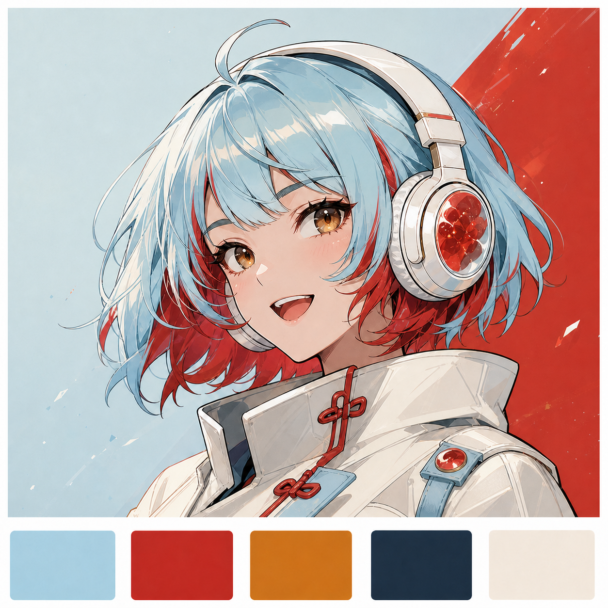
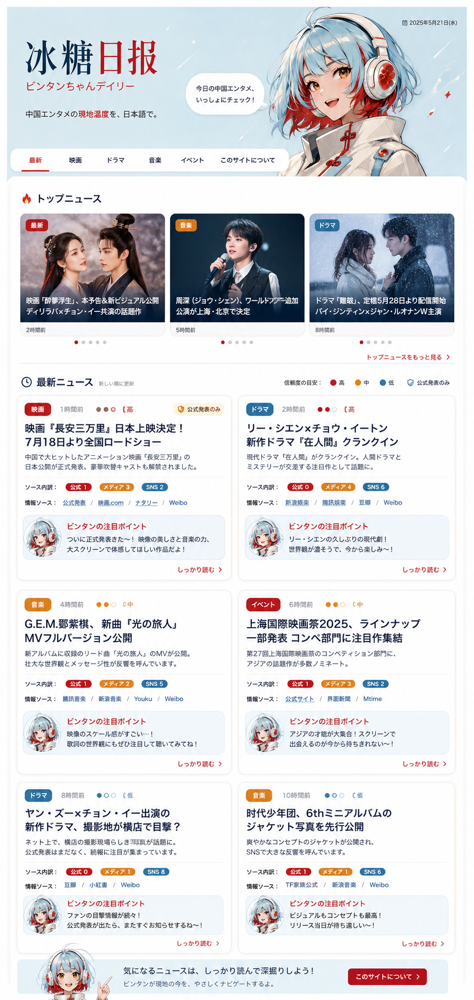

# Fable 引き渡し: Phase 4a ビンタンUI差分設計

作成日: 2026-07-16

## 1. 依頼の目的

既存の Phase 4 アーキテクチャ設計は維持したまま、その後に確定したキャラクターとサイトの方向性を反映し、Codex が判断を足さずに Phase 4a を実装できるUI差分設計を作る。

コードは変更しない。既存アーキテクチャ、記事データ構造、パイプライン、X bot 方針の変更・拡大もしない。

## 2. 読む順序

1. `AGENTS.md`
2. `docs/roadmap.md`
3. `docs/design-phase4-site.html`
4. `docs/design-phase4-character.md`
5. `docs/editorial-character.md`
6. 本書

## 3. 添付アセットと役割

### 3.1 キャラクター外見の正本

ファイル: `docs/assets/bingtang-character-final-reference.png`

この画像で確定しているもの:

- 冰糖（ビンタン）の顔、年齢感、明るい表情
- 淡い氷青を主色にした短いボブとアホ毛
- 山査子レッドの襟足インナーと、前髪内側から少量見える赤
- アンバー系の瞳
- 白いヘッドホンと赤い糖菓風イヤーカップ
- 白〜アイボリーの中華風ハイカラージャケットと赤い結び飾り
- 「氷＋糖」を、淡い氷青・赤・アンバー・濃紺・アイボリーで表す方向

注意:

- 外見デザインの正本であり、背景と下部パレットを含むこの画像を、そのまま公開用画像として使うという意味ではない。
- 透過立ち絵、丸型アバター、ヘッダー用横長トリミング、Xアイコンなどの公開用素材仕様は、今回の差分設計で定義する。
- 新しい顔、髪型、衣装、髪色の再提案は不要。

### 3.2 サイト方向性の参照（B案）

ファイル: `docs/assets/phase4a-ui-direction-b-reference.png`

採用する要素:

- キャラクターを中心にした明るいヘッダー
- 読者を案内する秘書としてのビンタンの見せ方
- 白地を中心にした軽快なカードUI
- カテゴリ、鮮度、確度、ソース構成を素早く読める階層
- 各記事内の小さなアバター付き「ビンタンの注目ポイント」
- PCでもスマホでも一覧性を保てるカードのリズム

採用しない要素:

- 記事カードの写真・人物写真・作品写真
- 画像生成された架空の作品サムネイル
- 参照画像内の架空タイトル、文章、日付、数値
- キャラクターを記事ごとに大きく反復して、本文より目立たせる構成
- かわいさを優先して出典、確度、公式のみ警告を弱くすること

**「B案採用」は画像の完全再現ではない。写真なし・キャラ中心・明るいカードUIという方向性の採用である。**

## 4. 確定事項

- サイト名: `冰糖日报`
- 読み・副題: `ビンタンちゃんデイリー`
- キャラクター名: `冰糖（ビンタン）`
- タグライン候補の基準文: `中国エンタメの現地温度を、日本語で。`
- ライトテーマ
- 写真素材は基本的に使わない
- ビンタンをサイトの案内役として前面に出す
- 記事本文の報道部分と、ビンタンの人格が出る枠を混同しない
- 全記事に出典とソース構成を表示する
- 公式のみの記事は警告表示を弱めない
- データにない反応・文脈・背景をUI都合で追加しない
- 「タイトル未設定」バグはコミット `1676d3e` で修正済み

## 5. 既存設計との不一致（今回解消すること）

以下は既存文書が古くなっているため、既存記述をそのまま実装しない。

1. `docs/design-phase4-site.html` §6・§9 は旧A案（ミーシュ／パンダ／写真中心）のモック。
2. `docs/design-phase4-character.md` §5 のミント×コーラル配色と参照画像は、今回確定した氷青×山査子レッドの外見より前の案。
3. 同文書の V1 と未確認事項には、キャラクターが「非最終」と書かれた箇所が残っている。
4. サイト設計 §10 には、確定済みのサイト名・キャラ名が未決として残っている。
5. 既存の実寸モックは写真を前提に情報階層を作っているため、写真なしカードで同じ可読性をどう維持するかが未定義。

設計変更が必要な項目と、単なる文書更新で済む項目を分けて記載すること。アーキテクチャ変更が必要に見える場合は、変更せず判断事項として報告すること。

## 6. Fableの成果物

### 必須成果物

`docs/design-phase4a-bingtang-ui.md`

この文書を Phase 4a のUI実装正本とし、既存の `docs/design-phase4-site.html` はアーキテクチャ・データ対応・段階導入の正本として残す。両者が競合する場合の優先順位を新文書の冒頭に明記する。

必ず含めるもの:

1. PCとスマホの画面構成
2. 写真なし記事カードの具体的な視覚表現
3. ビンタンの配置、サイズ、登場頻度、繰り返し上限
4. ヘッダー、トップ、日次、個別記事、About、フッターの仕様
5. 色、文字、余白、角丸、境界線、影などのデザイントークン
6. 最終画像から作る公開用キャラ素材の種類、寸法、トリミング、safe area、背景、代替表示
7. 通常、公式のみ、複数ソース、長いタイトル、記事0件、取得失敗などの状態
8. PC・タブレット・スマホのレスポンシブ仕様
9. Phase 4a と 4b 以降の境界
10. Codex向けのファイル単位実装手順
11. `npm run check`、静的ビルド、ローカル表示、PC・スマホスクリーンショットを含む検証手順
12. 機能・編集ガードレール・視覚品質それぞれの受け入れ基準
13. 実装後にFableがレビューするためのチェックリスト

### 文書整合の更新

- `docs/design-phase4-character.md` の V1、固定要素、配色、未確認事項を、確定画像に合わせて更新する。
- `docs/design-phase4-site.html` は歴史的モックを残し、§6・§9・§10に新UI正本への参照と確定状況を追記する。モック本体を新デザインへ全面改稿しない。
- `docs/roadmap.md` に差分設計完了と次の Codex 実装タスクを記載する。

## 7. スコープ外・公開前の別確認

次は今回のUI差分設計では確定させず、公開前の確認事項として残す。

- X APIの料金とURL付き投稿条件の一次確認
- Xハンドル、商標、ドメインの一次確認
- LICENSE・引用ポリシーの最終整備
- 公開用キャラ画像の生成・透過処理そのもの

## 8. Fableへの実行指示

本書と参照ファイルを基に、必須成果物と文書整合の更新だけを行う。コード実装は行わない。

迷った場合は、情報の信頼性、出典の見やすさ、本文の可読性を、キャラクター演出より優先する。仕様の変更・拡大はせず、必要なら「判断が必要な点」として止める。
